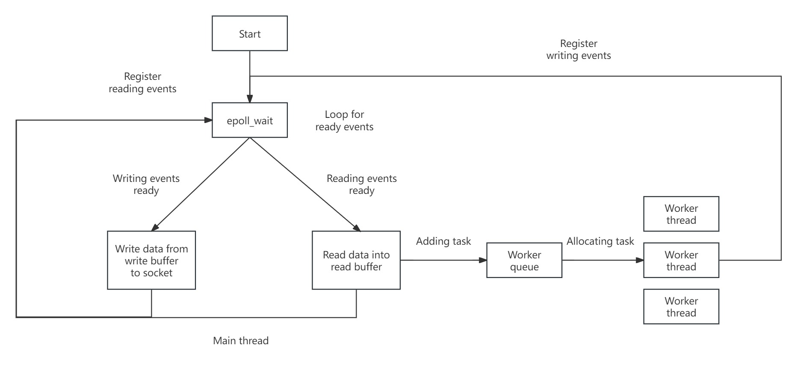

# Simple HTTP1.0 WebServer

## Features

- Http 1.0 webserver, supporting GET requests
- Supporting concurrent access to the server using a thread pool in semi-synchronous/semi-async mode
  - The main thread in asynchronous mode uses epoll (ET mode) to listen to events on the socket
  - The worker thread in synchronous mode performs HTTP request parsing and HTTP response construction
- Not only support requests called by curl, but it also supports the requests called by socket directly.

## Design




## Compiling

```
mkdir build
cd build
cmake ..
make
```

## Starting
Note: Before starting server, please make sure the webroot directory exists  
Copy dir/readme.txt to the directory  
Usage:  
./webserver ip_address port_number webroot thread_pool_size  
eg: ./webserver 127.0.0.1 8080 /var/www 5  

## Simple Test
printf 'GET http://localhost:8080/dir/readme.txt HTTP/1.0\r\n\r\n' |nc localhost 8080  
curl -i --http1.0 http://127.0.0.1:8080/dir/readme.txt

## Test Report / Test Coverage
[Test Report](./doc/test_cases.md) ':include'

## Performance Benchmark Report
[Performance Benchmark Report](./doc/benchmark_report.md)
