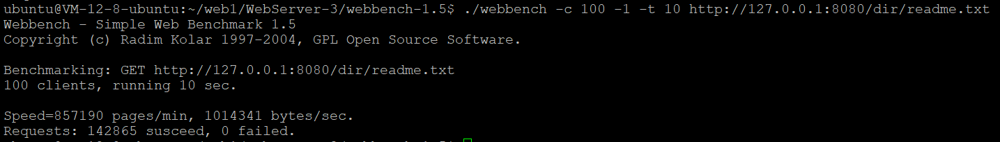
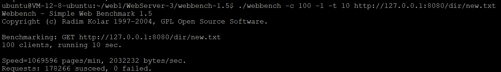
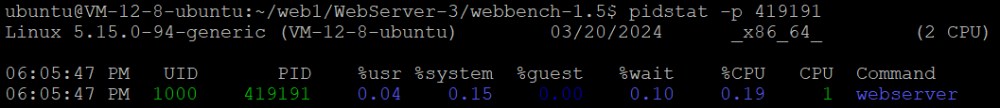
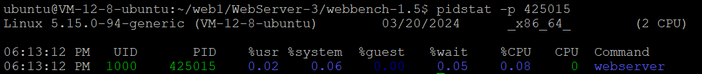

Performance Benchmark Report

## Test Env
Tencent cloud machine  
CPU core: 2  
Memory: 2G  
System: Ubuntu Server 22.04 LTS 64bit  

## Benchmark Test Client
webbench1.5

## Benchmark Test Report

1.Response is 200 OK and file content  

| thread_pool_size  | client_num  | test_time(s)  |  QPS |
|---|---|---|---|
| 5  | 10  | 10  | 14106  |
| 5  | 50  | 10  | 14145  |
| 5  | 100  | 10  | 14363  |
| 10  | 10  | 10  | 14370  |
| 10  | 50  | 10  | 14497  |
| 10  | 100 | 10  | 14286  |

**Read file, the max QPS is 14000+**

2.Response is 404  

| thread_pool_size  | client_num  | test_time(s)  |  QPS |
|---|---|---|---|
| 5  | 10  | 10  | 17465  |
| 5  | 50  | 10  | 17654  |
| 5  | 100  | 10  | 17826  |
| 10  | 10  | 10  | 17628  |
| 10  | 50  | 10  | 17124  |
| 10  | 100 | 10  | 17266  |

**File not exists, the max QPS is 17000+**

3.CPU usage
pool_size = 5, client_num = 100, test_time = 5min, Response = file, QPS = 14000+

According to pidstat, the cpu usage of webserver is 0.19%  

pool_size = 5, client_num = 100, test_time = 5min, Response = 404, QPS = 17000+

According to pidstat, the cpu usage of webserver is 0.08%  

4. Memory usage
No cache, so memory usage is low.
